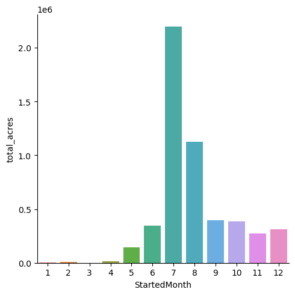
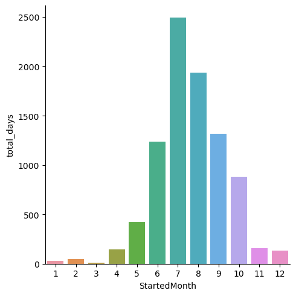

Wildfire Prediction in California Counties
==============================

This is my first capstone project for Springboard.

# Introduction

In 2020 alone, wildfires burned 4.2 million acres of land, and 31 people died[^1]. Responses to fires were strained; there were not enough resources and crew to take care of the fires. They were forced to request off-duty firefighters to return to work. Aside from direct destruction, fires indirectly affect other aspects of civilian life, including health and business. Evacuations and poor air quality can prevent people from maintaining and using their facilities for extended periods of time. For example, due to the Caldor Fire, a restaurant in South Lake Tahoe lost $10,000 to $13,000 in perishables, even though there was no structural damage to the city, and overall, the city estimated its loss to be over $50 million [^2]. Insurance companies, local governments, or fire control may want to allocate resources or policies or deploy different awareness and mitigation strategies more specifically depending on each region's unique risk. This project aims to find counties that have fires and to determine how many fires they may have each year.

[^1]: J. Cart, “California’s 2020 fire siege: wildfires by the numbers,” Cal Matters, July 2021. ([Link](https://calmatters.org/economy/2021/10/california-wildfires-economic-impact/))
[^2]: G. Gedye, “How much do wildfires really cost California’s economy?” Cal Matters, October 2021. ([Link](https://calmatters.org/environment/2021/07/california-fires-2020/>))

## The Datasets

This project used a handful of data sources, but for the most part, the two CIMIS datasets were not used in the final model.

- Wildfire: 1636 wildfire incidents with 40 columns in the years 2013-2020, scraped by a Kaggle user, from the California Department of Forestry and Fire Protection (CAL FIRE) website. ([Link](https://www.kaggle.com/datasets/ananthu017/california-wildfire-incidents-20132020))
- Climate: 128000 entries with 19 columns of environmental conditions from 2017-2020, scraped by a Kaggle user, from the California Irrigation Management Information System (CIMIS) from the California Department of Water Resources. ([Link](https://www.kaggle.com/datasets/chelseazaloumis/cimis-dataset-with-fire-target))
- Station information: Further station information was taken from CIMIS, using their API, to expand the climate dataset with more location data. ([Link](https://cimis.water.ca.gov/))
- County information: Collected from Wikipedia, which has generic county information and 2022 census information from the National Association of Counties (NACo). ([Link](https://simple.wikipedia.org/wiki/List_of_counties_in_California))
- County geographical information: Downloaded a GEOJSON file containing geographical information of US counties, filtered for California counties only. ([Link](https://public.opendatasoft.com/explore/dataset/us-county-boundaries/table/))

# Project Organization
------------

    ├── LICENSE
    ├── Makefile           <- Makefile with commands like `make data` or `make train`
    ├── README.md          <- The top-level README for developers using this project.
    ├── data
    │   ├── external       <- Data from third party sources.
    │   ├── interim        <- Intermediate data that has been transformed.
    │   ├── processed      <- The final, canonical data sets for modeling.
    │   └── raw            <- The original, immutable data dump.
    │
    ├── models             <- Trained and serialized models, model predictions, or model summaries
    │
    ├── notebooks          <- Jupyter notebooks. Naming convention is a number (for ordering),
    │                         the creator's initials, and a short `-` delimited description, e.g.
    │                         `1.0-jqp-initial-data-exploration`.
    │
    ├── references         <- Data dictionaries, manuals, and all other explanatory materials.
    │
    ├── reports            <- Generated analysis as HTML, PDF, LaTeX, etc.
    │   └── figures        <- Generated graphics and figures to be used in reporting
    │
    ├── requirements.txt   <- The requirements file for reproducing the analysis environment, e.g.
    │                         generated with `pip freeze > requirements.txt`
    │
    ├── setup.py           <- makes project pip installable (pip install -e .) so src can be imported
    ├── src                <- Source code for use in this project.
    │   ├── __init__.py    <- Makes src a Python module
    │   │
    │   ├── data           <- Scripts to download or generate data
    │   │   └── make_dataset.py
    │   │
    │   ├── features       <- Scripts to turn raw data into features for modeling
    │   │   └── build_features.py
    │   │
    │   ├── models         <- Scripts to train models and then use trained models to make
    │   │   │                 predictions
    │   │   ├── predict_model.py
    │   │   └── train_model.py
    │   │
    │   └── visualization  <- Scripts to create exploratory and results oriented visualizations
    │       └── visualize.py
    │
    └── tox.ini            <- tox file with settings for running tox; see tox.readthedocs.io

--------

<small>Project based on the <a target="_blank" href="https://drivendata.github.io/cookiecutter-data-science/">cookiecutter data science project template</a>. #cookiecutterdatascience</small>

# Data Wrangling

[Notebook link](notebooks/1.0-rc-data-wrangling.ipynb).

At this step, data was collected and defined and underwent a preliminary cleaning. The wildfire dataset contained a lot of missing values, and much of the information did not seem to be standardized. A few important numerical features were mostly provided, such as the names, location information, number of acres burned, and dates. Other information that would have been nice to know could include the fuel type, the cause of fire, and more robust location data. There were some duplicate fires because if one fire could occur in multiple counties, but these could be determined using their unique IDs. The environmental conditions dataset was almost completely populated and clean, and the ranges and seeming outliers looked acceptable. However, this dataset was lacking information about the location of each data point or station. Furthermore, data was not retrieved from every station, so some areas of California were missing. Using the CIMIS API, a station information was added to our collection of datasets. By the end of this notebook, there were three dataframes: `fire_df` containing the wildfire dataset, `climate_df` containing the environmental conditions dataset, and `stations_df` containing information about the stations that recorded the data in `climate_df`.

Data descriptions for the original wildfire and environmental conditions datasets.

The wildfire dataset.

| Column | Dtype | Description |
| --- | --- | --- |
| AcresBurned | float64 | Acres of land affected by wildfires |
| Active | bool | Is the fire active or contained? |
| AdminUnit | object | Administrative unit |
| AirTankers | float64 | Resources assigned |
| ArchiveYear | int64 | Year the data was archived |
| CalFireIncident | bool | Is the incident treated as a CalFire incident? |
| CanonicalUrl | object | Part of URL for the information source |
| ConditionStatement | object | Descriptive status updates |
| ControlStatement | object | Information about current road closures and threats |
| Counties | object | Name of county origin |
| CountyIds | object | List of county IDs involved |
| CrewsInvolved | float64 | Resources assigned |
| Dozers | float64 | Resources assigned |
| Engines | float64 | Resources assigned |
| Extinguished | object | Date the fire was extinguished |
| Fatalities | float64 | Fatality count |
| Featured | bool | (Unknown but was 98% False) |
| Final | bool | (Unknown but was almost 100% True) |
| FuelType | object | Fuel type of the fire |
| Helicopters | float64 | Resources assigned |
| Injuries | float64 | Count of injured personnel |
| Latitude | float64 | Latitude of wildfire incident |
| Location | object | Description of the location |
| Longitude | float64 | Longitude of the wildfire incident |
| MajorIncident | bool | Is the fire considered a major incident? |
| Name | object | Name of the wildfire |
| PercentContained | float64 | Percent of the fire that is contained |
| PersonnelInvolved | float64 | Resources assigned |
| Public | bool | (Unknown but was 100% True) |
| SearchDescription | object | "Description" meta content in HTML head |
| SearchKeywords | object | "Keywords" meta content in HTML head |
| Started | object | Date the fire started |
| Status | object | Status of the fire |
| StructuresDamaged | float64 | Count of structures damaged |
| StructuresDestroyed | float64 | Count of structures destroyed |
| StructuresEvacuated | float64 | Count of structures evacuated |
| StructuresThreatened | float64 | Count of structures threatened |
| UniqueId | object | Unique ID for the wildfire incident |
| Updated | object | Last date of update |
| WaterTenders | float64 | Resources assigned |

The environmental conditions dataset.

| Column | Dtype | Description |
| --- | --- | --- |
| Stn Id | int64 | ID of the station |
| Stn Name | object | Name of the station |
| CIMIS Region | object | Region of the station |
| Date | object | Date of the measurements |
| ETo (in) | float64 | Reference evapotranspiration |
| Precip (in) | float64 | Precipitation |
| Sol Rad (Ly/day) | float64 | Average solar radiation |
| Avg Vap Pres (mBars) | float64 | Average vapor pressure |
| Max Air Temp (F) | float64 | Maximum air temperature |
| Min Air Temp (F) | float64 | Minimum air temperature |
| Avg Air Temp (F) | float64 | Average air temperature |
| Max Rel Hum (%) | float64 | Maximum relative humidity |
| Min Rel Hum (%) | float64 | Minimum relative humidity |
| Avg Rel Hum (%) | float64 | Average relative humidity |
| Dew Point (F) | float64 | Dew point |
| Avg Wind Speed (mph) | float64 | Average wind speed |
| Wind Run (miles) | float64 | Wind run |
| Avg Soil Temp (F) | float64 | Average soil temperature |
| Target | int64 | Geography or weather station of interest |

# Exploratory Data Analysis

[Notebook link](notebooks/2.1-rc-exploratory-data-analysis.ipynb).

Here we explored the data to understand each feature and their relationships with one another, and we engineered some features. Mostly, a lot of cleaning was required, and some data was verified or fixed after some investigation.

## A. Fire Data

The fire data was pruned somewhat aggressively; if a feature had more than 20% missing values, then it was dropped. Features with missing values that were deemed potentially important at the time were cross-referenced with online sources or filled by imputation.

**Dates**: Larger wildfire incidents’ dates could be fixed by checking their values in the Redbooks, which are written and released by the California Department of Forestry and Fire Protection. For the bad dates of smaller fires, most of them were approximated by considering all three of the incident’s dates (Started, Extinguished, and Updated) and occasionally the canonical URL (which corresponds to an incident’s Started date), since in most cases, only one of the three were erroneous. Finally, if both using existing dates and using the canonical URL failed, the yet remaining small fires were simply assigned to have lasted only one day. Two features were extracted from the existing date information: the year and month of the started date.

**Geographic coordinates**: The dataset contained some bad latitude and longitude coordinates, and an investigation revealed that in most cases, this was generally a repeat input, a swap of the two coordinates, a typo, or an arbitrary input. About 160 bad coordinates for latitude and longitude were found using a generous rectangular range of California’s boundaries. There was only one coordinate that skipped this basic filter that was revealed in a plot of the coordinates. The bad coordinates were simply reassigned to match the center coordinates of the fire’s county.

**Days active**: A new feature was created from existing features: the ActiveDays feature represents the number of days that the fire burned. This was simply a subtraction of the Started date from the Extinguished date, which revealed that there were unfortunately *many* unreliable Extinguished dates. A lot of dates appeared to be default dates. Namely, some fires were extinguished in the following January, even tiny fires that may have started in early summer. The correct date was imputed primarily using medians of subsets of fires, since the mean can be very volatile because a few outlier fires can burn substantially longer than most.

## B. Environmental Conditions Data

Counties were added to the environmental conditions (climate) dataset from the `stations_df`. There were not too many missing values in the `climate_df`, so these missing values were imputed using the mean values within the same month from either the same station in a different year or from the same county if that station always had missing values for every year and month combination. The climate data was also aggregated in months per county for further exploration.

## C. County Data

County characteristics were scraped from the “List of counties in California” Wikipedia page. Two features were basically added to the existing county data: the population in 2022 and the area in square miles. We lack information about the environments of these fire incidents, but the size and population density may hint at environmental characteristics. Wildfires need fuel, which means that they would prefer places with a lot of things to burn, such as forests and chaparrals, so a larger size and lower population density may be favored by fires, though houses can serve as fuel as well. Other features were aggregated and engineered for the counties, such as population density, fire proportions, and monthly statistics.

## D. Visualizations

The number of acres burned and days active have extreme outliers, and a vast majority of the fires were small and short. Summer and autumn months (June to October) experienced the most fires, though there were a few outliers in December and February, and the two years that had the most fires were 2017 and 2018.

Monthly fire figures

# Preprocessing and Modeling

[Notebook link](notebooks/3.0-rc-preprocessing-training.ipynb).
TODO

# Conclusion and Future Work

[Notebook link](notebooks/4.0-rc-modeling.ipynb).
TODO
